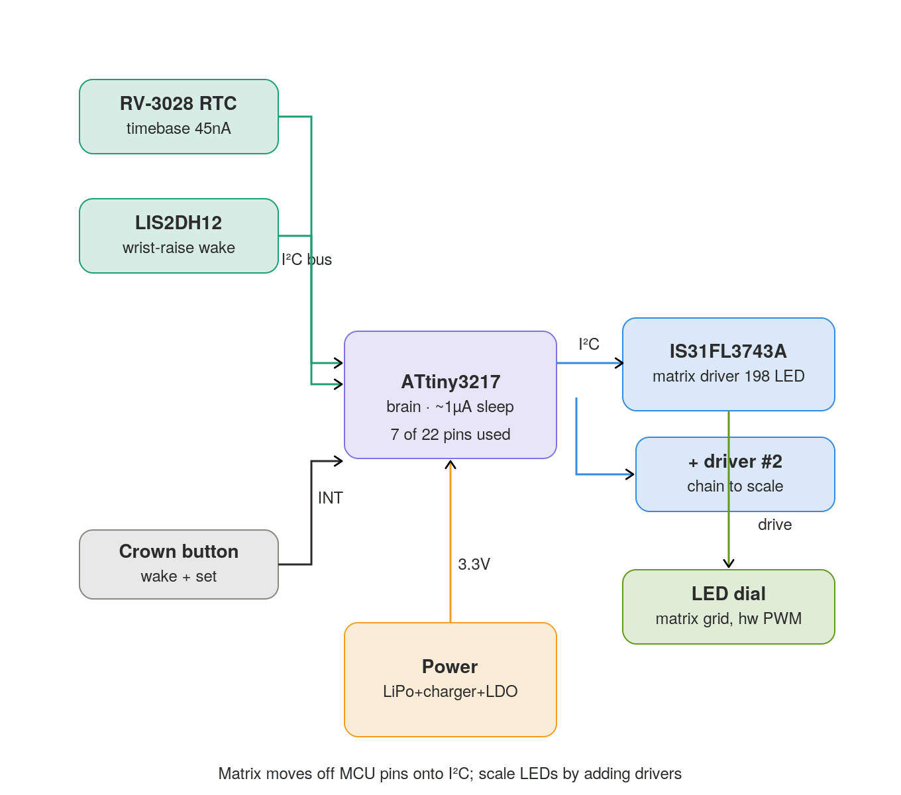
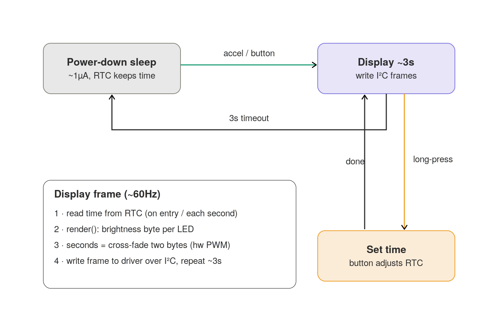
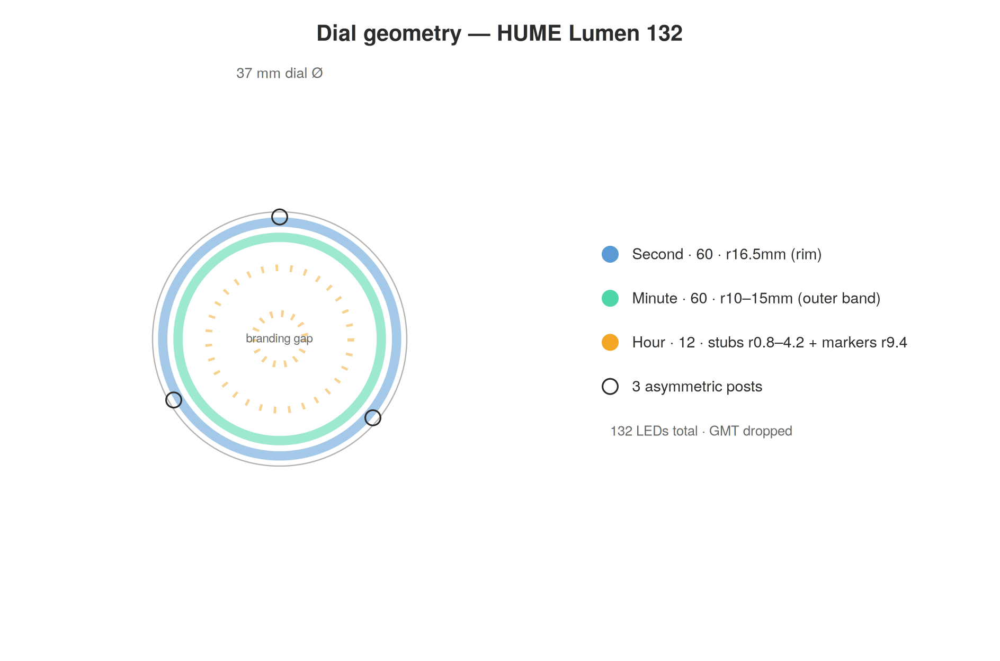
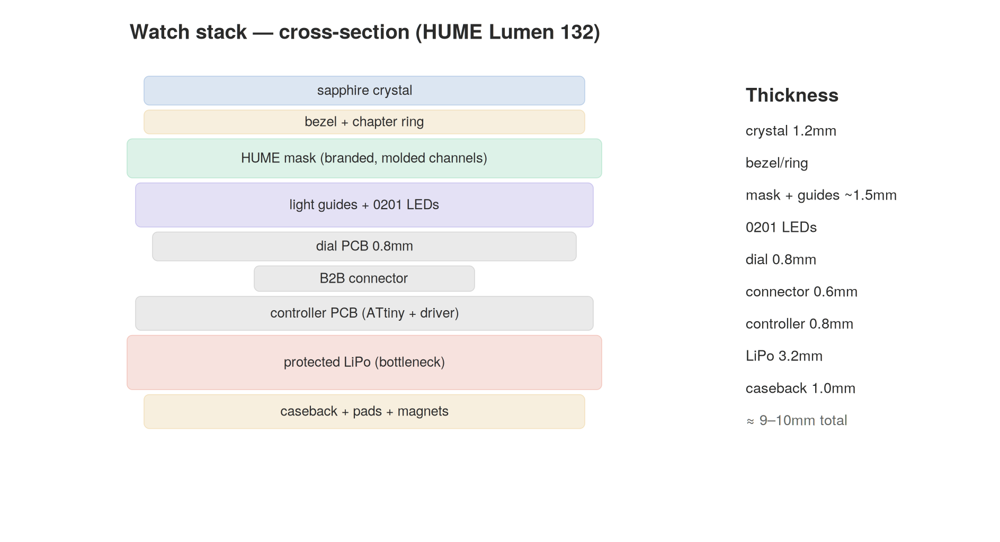

# Lumen 132

<picture>
  <source media="(prefers-color-scheme: dark)" srcset="renders/HUME-Lumen-132.gif">
  
</picture>

An open-hardware **LED wristwatch** that tells time with light. No mechanical hands,
no display module — time is shown by **132 individually-addressable LEDs** in
concentric rings on a PCB dial, their light carried to the face through optical
guides set into a branded mask. The watch stays dark until you raise your wrist or
press the crown, then lights the time for a few seconds and sleeps again.

The "132" is the watch: **60 second + 60 minute + 12 hour** LEDs. As the platform
scales (the driver supports more), the model number scales with it.

> **Status: design complete, pre-fabrication.** Architecture, geometry, power
> budget, BOM, firmware structure, and KiCad inputs are specified. No boards
> ordered yet. See [Build status](#build-status).

---

## Concept

A glance-to-read light watch. At rest the dial is dark and reads as a clean branded
face. On a wrist-raise (accelerometer) or crown press, the controller wakes, reads
the time from a low-power RTC, and lights one LED in each ring — second, minute,
hour — for ~3 seconds, then returns to deep sleep. Brightness and the smooth second
sweep are handled in hardware by a dedicated LED matrix driver, so the
microcontroller barely works.

## How it's built

| Subsystem | Choice |
|---|---|
| Brain | **ATtiny3217** (modern tinyAVR, ~7 of 22 pins used) |
| LED driving | **Lumissil IS31FL3743A** matrix driver over I²C — hardware 8-bit PWM per LED |
| LEDs | 132 × 0201 (60 second + 60 minute + 12 hour) |
| Timebase | RV-3028 RTC (~45 nA) |
| Wake | LIS2DH12 accelerometer + crown button (interrupts) |
| Power | protected LiPo, MCP73831 charger, low-Iq LDO, magnetic pogo charging |
| Case | off-the-shelf 39.5 mm Seiko-mod style, 37 mm dial |

The matrix lives entirely on the I²C bus, so **scaling the LED count means adding
driver chips, not microcontroller pins** — one driver handles up to 198 LEDs, and
up to four chain on one bus (~400+).

### Controller architecture

<picture>
  <source media="(prefers-color-scheme: dark)" srcset="diagrams/01_controller_schematic_dark.png">
  
</picture>

### Firmware flow

The firmware is a simple sleep/wake loop — the driver does the hard real-time work.

<picture>
  <source media="(prefers-color-scheme: dark)" srcset="diagrams/02_firmware_states_dark.png">
  
</picture>

## The dial

Time reads across three concentric zones radiating from the center, with the
branding sitting in a clear gap between them:

- **Hour** — 12 short amber light-channel stubs branching from the center, plus a
  ring of 12 outer markers just inside the minute band. The active hour lights both,
  and the eye connects them into one long hour-hand reference.
- **Branding gap** — the HUME crest, wordmark, ANTHROP\C co-brand, and
  MASTER CHRONOMETER, clear of the indicators.
- **Minute** — 60 thin green channels in the outer band.
- **Second** — 60 flush square segments at the rim, electric blue, with a smooth
  hardware-PWM sweep.

<picture>
  <source media="(prefers-color-scheme: dark)" srcset="diagrams/03_dial_geometry_dark.png">
  
</picture>

### Dial-as-mask

The branded HUME dial is a physical **mask** over the LED PCB. The seconds are flush
light-guide windows set into the mask face; the hour and minute "hands" are molded
raised channels — flat-bottomed ridges seated along their whole length on the mask
(supported, not free-floating pipes), lit from the LEDs beneath. Every position is a
physical guide, faint when unlit; only the active second/minute/hour lights.

An interactive 3D render of this lives in
[`renders/watch_hume_3d_mask.html`](renders/watch_hume_3d_mask.html) — open it in a
browser (orbit/tilt/pan/zoom, exploded-layer toggle).

## The stack

<picture>
  <source media="(prefers-color-scheme: dark)" srcset="diagrams/04_full_stack_dark.png">
  
</picture>

The protected LiPo is the thickness bottleneck (~3.2 mm); total stack is ~9–10 mm,
which fits the target case.

## Repository layout

```
CONTEXT.md            full design handoff — start here to resume the project
bom/                  sourced bill of materials (~$131/watch), live spreadsheet
diagrams/             the 4 diagrams above (light + dark)
firmware/             ATtiny3217 + driver firmware skeleton (C)
pcb/dial/             dial matrix wiring, netlist, placement, layout render
pcb/controller/       controller board parts, pin budget, layout render
kicad/                footprint library, pcbnew placement script, workflow guide
renders/              interactive 3D render (open in browser) + flat dial render
```

## Build status

Design is complete and internally consistent; nothing has been fabricated.

**Done:** architecture, dial geometry, controller schematic, BOM, dial matrix
wiring + netlist, firmware skeleton, KiCad footprint library + placement script +
workflow.

**Next:** verify the IS31FL3743A land against the vendor drawing → draw schematics
and route both boards in KiCad → a single-position light-guide prototype to
de-risk the mask optics → first PCB order.

## A note on the name

**HUME** is the brand; **Lumen** nods to the unit of luminous flux (and to an optical
channel — which is what the light guides are); **132** is the LED count that defines
the watch. The philosopher David Hume was an empiricist — knowledge comes from what
you observe — which suits a watch that only answers when you look at it.

## License

See [LICENSE](LICENSE). *(Add your chosen license before publishing.)*
