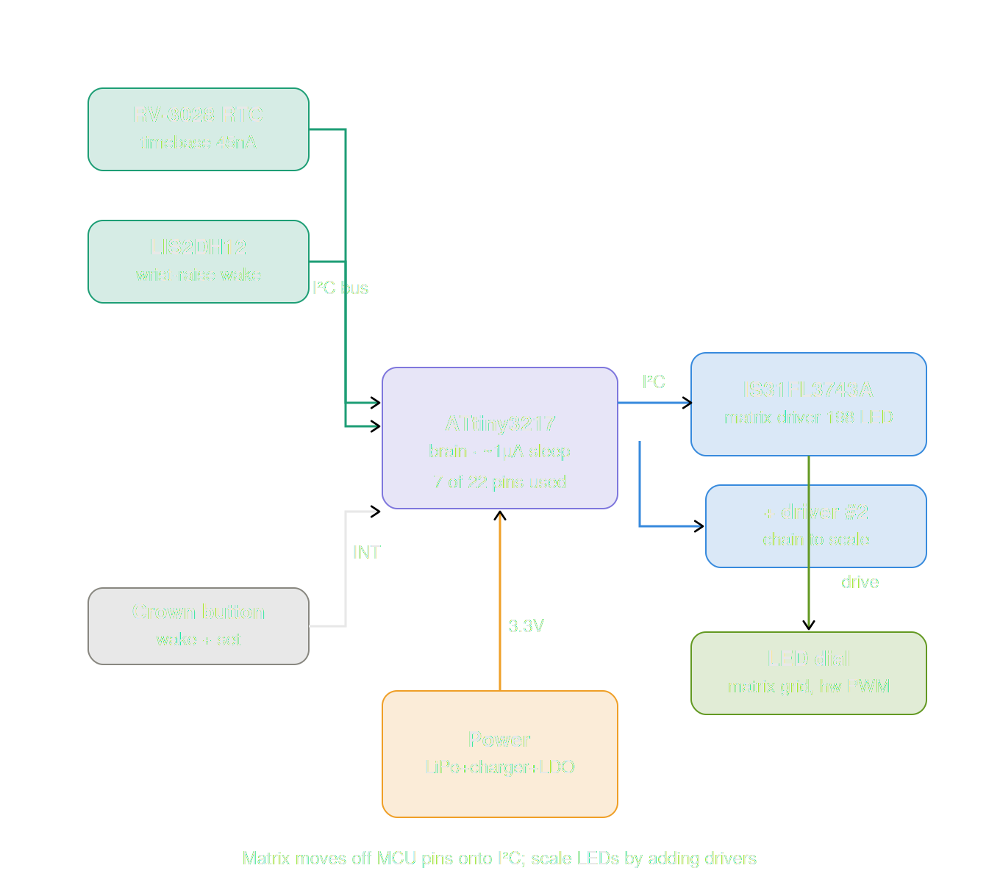
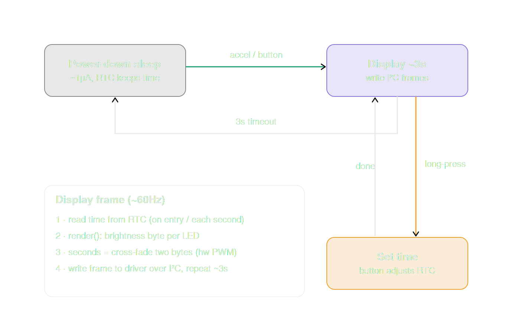
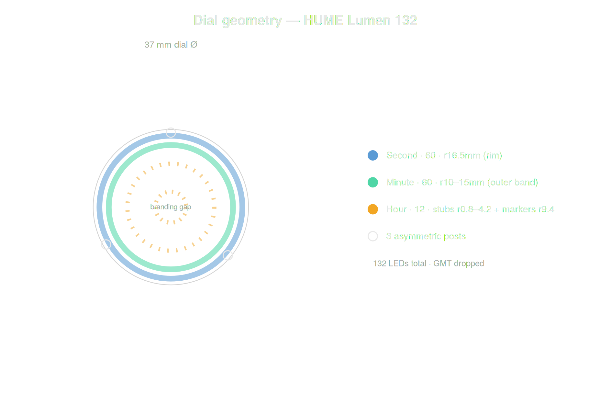
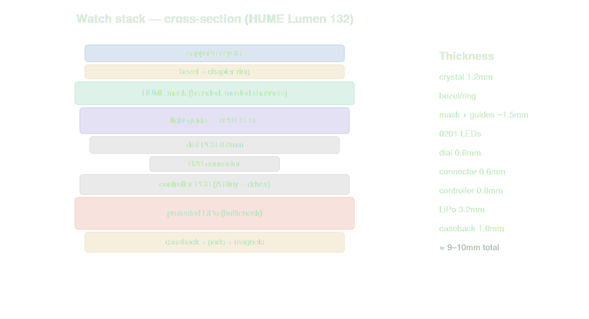

# Lumen 132

<picture>
  <source media="(prefers-color-scheme: dark)" srcset="renders/HUME-Lumen-132.gif">
  
</picture>

An open-hardware **LED wristwatch** that tells time with light. No mechanical hands,
no display module — time is shown by **132 individually-addressable LEDs** in
concentric rings on a PCB dial, their light carried to the face through optical
guides set into a branded mask. The watch stays dark until you raise your wrist or
press the crown, then lights the time for a few seconds and sleeps again.

The "132" is the watch: **60 second + 60 minute + 12 hour** LEDs. As the platform
scales (the driver supports more), the model number scales with it.

> [!IMPORTANT]
> This project is a work in progress, please use repo at your own risk.
> 
> **Current project status:
> Design complete, pre-fabrication.** Architecture, geometry, power
> budget, BOM, firmware structure, and KiCad inputs are specified. No boards
> ordered yet. See [Build status](#build-status).

> [!CAUTION]
> The goal for this project is to see how far Claude can go building a homebrew diy watch. I'm still deep in the weeds with Claude and haven't evaluated everything in this repo, so proceed with caution.

---

## Concept

A glance-to-read light watch. At rest the dial is dark and reads as a clean branded
face. On a wrist-raise (accelerometer) or crown press, the controller wakes, reads
the time from a low-power RTC, and lights one LED in each ring — second, minute,
hour — for ~3 seconds, then returns to deep sleep. Brightness and the smooth second
sweep are handled in hardware by a dedicated LED matrix driver, so the
microcontroller barely works.

## How it's built

| Subsystem | Choice |
|---|---|
| Brain | **ATtiny3217** (modern tinyAVR, ~7 of 22 pins used) |
| LED driving | **Lumissil IS31FL3743A** matrix driver over I²C — hardware 8-bit PWM per LED |
| LEDs | 132 × 0201 (60 second + 60 minute + 12 hour) |
| Timebase | RV-3028 RTC (~45 nA) |
| Wake | LIS2DH12 accelerometer + crown button (interrupts) |
| Power | protected LiPo, MCP73831 charger, low-Iq LDO, magnetic pogo charging |
| Case | off-the-shelf 39.5 mm Seiko-mod style, 37 mm dial |

The matrix lives entirely on the I²C bus, so **scaling the LED count means adding
driver chips, not microcontroller pins** — one driver handles up to 198 LEDs, and
up to four chain on one bus (~400+).

### Controller architecture

<picture>
  <source media="(prefers-color-scheme: dark)" srcset="diagrams/01_controller_schematic_dark.png">
  <p width="100%" align="center">
    
  </p>
</picture>

### Firmware flow

The firmware is a simple sleep/wake loop — the driver does the hard real-time work.

<picture>
  <source media="(prefers-color-scheme: dark)" srcset="diagrams/02_firmware_states_dark.png">
  <p width="100%" align="center">
    
  </p>
</picture>

## The dial

Time reads across three concentric zones radiating from the center, with the
branding sitting in a clear gap between them:

- **Hour** — 12 short amber light-channel stubs branching from the center, plus a
  ring of 12 outer markers just inside the minute band. The active hour lights both,
  and the eye connects them into one long hour-hand reference.
- **Branding gap** — the HUME crest, wordmark, ANTHROP\C co-brand, and
  MASTER CHRONOMETER, clear of the indicators.
- **Minute** — 60 thin green channels in the outer band.
- **Second** — 60 flush square segments at the rim, electric blue, with a smooth
  hardware-PWM sweep.

<picture>
  <source media="(prefers-color-scheme: dark)" srcset="diagrams/03_dial_geometry_dark.png">
  <p width="100%" align="center">
    
  </p>
</picture>

### Dial-as-mask

The branded HUME dial is a physical **mask** over the LED PCB. The seconds are flush
light-guide windows set into the mask face; the hour and minute "hands" are molded
raised channels — flat-bottomed ridges seated along their whole length on the mask
(supported, not free-floating pipes), lit from the LEDs beneath. Every position is a
physical guide, faint when unlit; only the active second/minute/hour lights.

An interactive 3D render of this lives in
[`renders/watch_hume_3d_mask.html`](renders/watch_hume_3d_mask.html) — open it in a
browser (orbit/tilt/pan/zoom, exploded-layer toggle).

## The stack

<picture>
  <source media="(prefers-color-scheme: dark)" srcset="diagrams/04_full_stack_dark.png">
  <p width="100%" align="center">
    
  </p>
</picture>

The protected LiPo is the thickness bottleneck (~3.2 mm); total stack is ~9–10 mm,
which fits the target case.

## BOM

| #                                           | Designator(s) | Component                       | MPN                        | Package  | Qty | Unit $                   | Line $  | Distributor  | Source / notes                                                                                                 |
|---------------------------------------------|---------------|---------------------------------|----------------------------|----------|-----|--------------------------|---------|--------------|----------------------------------------------------------------------------------------------------------------|
| DIAL BOARD + MASK                           |               |                                 |                            |          |     |                          |         |              |                                                                                                                |
| 1                                           | D1–D132       | LED 0201 (per-ring colors)      | Kingbright APG0201xxC-TT   | 0201     | 132 | $0.210                   | $27.720 | DigiKey/LCSC | 132 = 60 sec + 60 min + 12 hour (GMT dropped). ~$0.21@100. Wired in the driver's matrix grid, not Charlieplex. |
| 2                                           | J1(dial)      | Board-to-board hdr              | matrix rows/cols + V + GND | —        | 1   | $0.400                   | $0.400  | LCSC         | Carries the driver matrix lines to the dial.                                                                   |
| 3                                           | —             | Dial PCB 2-layer 37mm           | custom                     | —        | 1   | $5.000                   | $5.000  | JLCPCB       | Driver matrix grid is simpler than 4-layer Charlieplex; may drop to 2-layer. ENIG, black mask.                 |
| 4                                           | —             | Mask / light-guide plate        | custom                     | —        | 1   | $5.500                   | $5.500  | JLCPCB/3D    | Branded HUME mask: flush square second guides + raised hour/minute pipes. Evolved from alignment plate.        |
| CONTROLLER BOARD (ATtiny3217 + IS31FL3743A) |               |                                 |                            |          |     |                          |         |              |                                                                                                                |
| 6                                           | U1            | MCU ATtiny3217                  | ATTINY3217-MFR             | QFN-24   | 1   | $1.050                   | $1.050  | LCSC         | ~$1.04 LCSC (-MFR). 22 I/O, ~7 used. Replaces ATmega328.                                                       |
| 7                                           | U2            | LED matrix driver               | IS31FL3743A                | QFN      | 1   | $1.000                   | $1.000  | LCSC/DigiKey | 198 LEDs, 8-bit hw PWM each, I2C. ~$1 @10k. Chain up to 4 for ~400+ LEDs.                                      |
| 8                                           | U3            | RTC                             | RV-3028-C7                 | SON-8    | 1   | $1.490                   | $1.490  | LCSC         | 45nA timebase, I2C.                                                                                            |
| 9                                           | U4            | Accelerometer                   | LIS2DH12TR                 | LGA-12   | 1   | $0.450                   | $0.450  | LCSC         | Wrist-raise wake, I2C+INT.                                                                                     |
| 10                                          | U5            | LiPo charger                    | MCP73831T-2ACI/OT          | SOT-23-5 | 1   | $0.760                   | $0.760  | DigiKey      |                                                                                                                |
| 11                                          | U6            | LDO 3.3V low-Iq                 | TPS7A2033PDBVR             | SOT-23-5 | 1   | $0.330                   | $0.330  | DigiKey      | ~25nA Iq.                                                                                                      |
| 12                                          | R1            | R_EXT (sets array current)      | generic 0402 1%            | 0402     | 1   | $0.010                   | $0.010  | LCSC         | ONE resistor sets full-scale LED current. Replaces the 13 Charlieplex resistors.                               |
| 13                                          | R2–R3         | I2C pull-ups 4.7k               | generic 0402               | 0402     | 2   | $0.005                   | $0.010  | LCSC         |                                                                                                                |
| 14                                          | C1–C8         | Decoupling 0.1µF/1µF            | generic 0402               | 0402     | 8   | $0.010                   | $0.080  | LCSC         | MCU/driver/RTC/accel/LDO.                                                                                      |
| 15                                          | BT1           | Protected LiPo cell             | 110mAh pouch w/ PCM        | —        | 1   | $4.500                   | $4.500  | varies       | Mandatory protection (skin contact). Sets case depth.                                                          |
| 16                                          | Q1            | Reverse-prot / dead-pad FET     | generic SOT                | SOT-23   | 1   | $0.100                   | $0.100  | LCSC         | Charge-path protection + dead pads until charger detected.                                                     |
| 17                                          | J1(ctrl)      | B2B hdr (mate)                  | generic                    | —        | 1   | $0.400                   | $0.400  | LCSC         | Mates dial J1.                                                                                                 |
| 18                                          | —             | Controller PCB 2-layer ~31mm    | custom                     | —        | 1   | $2.000                   | $2.000  | JLCPCB       | Sparse 2-layer.                                                                                                |
| CASE / OPTICS / MECHANICAL                  |               |                                 |                            |          |     |                          |         |              |                                                                                                                |
| 20                                          | —             | Seiko-mod case 39.5mm           | off-the-shelf              | —        | 1   | $35.000                  | $35.000 | watch-mod    | Sub-style; price varies.                                                                                       |
| 21                                          | —             | Sapphire crystal (domed)        | off-the-shelf              | —        | 1   | $12.000                  | $12.000 | watch-mod    |                                                                                                                |
| 22                                          | —             | Bezel / chapter ring            | off-the-shelf              | —        | 1   | $6.000                   | $6.000  | watch-mod    | Plain bezel now (GMT 24h scale dropped).                                                                       |
| 23                                          | —             | PMMA fiber / acrylic pipe stock | bulk                       | —        | 1   | $6.000                   | $6.000  | varies       | For 132 guides + raised hand pipes.                                                                            |
| 24                                          | —             | Magnetic charging puck          | DIY/off-the-shelf          | —        | 1   | $6.000                   | $6.000  | varies       | Pogo pins + magnet; external.                                                                                  |
| 25                                          | —             | Strap                           | off-the-shelf              | —        | 1   | $15.000                  | $15.000 | varies       |                                                                                                                |
|                                             |               |                                 |                            |          |     | Dial+mask subtotal       | $38.62  |              |                                                                                                                |
|                                             |               |                                 |                            |          |     | Controller subtotal      | $12.18  |              |                                                                                                                |
|                                             |               |                                 |                            |          |     | Case/optics subtotal     | $80.00  |              |                                                                                                                |
|                                             |               |                                 |                            |          |     | PER-WATCH TOTAL (1 unit) | $130.80 |              |                                                                                                                |

## Repository layout

```
CONTEXT.md            full design handoff — start here to resume the project
bom/                  sourced bill of materials (~$131/watch), live spreadsheet
diagrams/             the 4 diagrams above (light + dark)
firmware/             ATtiny3217 + driver firmware skeleton (C)
pcb/dial/             dial matrix wiring, netlist, placement, layout render
pcb/controller/       controller board parts, pin budget, layout render
kicad/                footprint library, pcbnew placement script, workflow guide
renders/              interactive 3D render (open in browser) + flat dial render
```

## Build status

Design is complete and internally consistent; nothing has been fabricated.

**Done:** architecture, dial geometry, controller schematic, BOM, dial matrix
wiring + netlist, firmware skeleton, KiCad footprint library + placement script +
workflow.

**Next:** verify the IS31FL3743A land against the vendor drawing → draw schematics
and route both boards in KiCad → a single-position light-guide prototype to
de-risk the mask optics → first PCB order.

## A note on the name

**HUME** is the brand; **Lumen** nods to the unit of luminous flux (and to an optical
channel — which is what the light guides are); **132** is the LED count that defines
the watch. The philosopher David Hume was an empiricist — knowledge comes from what
you observe — which suits a watch that only answers when you look at it.

## License

See [LICENSE](LICENSE). *(Add your chosen license before publishing.)*
