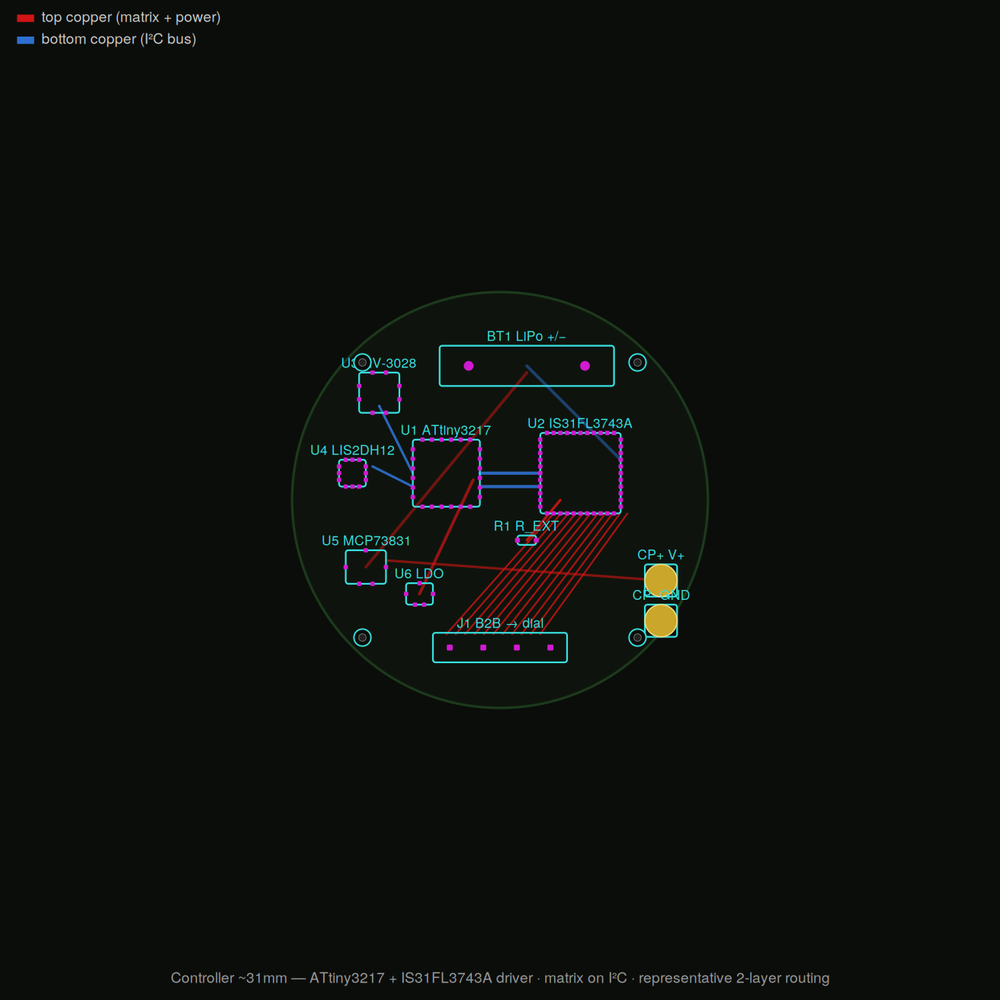

# Controller board (~31mm) — ATtiny3217 + IS31FL3743A

> **Architecture reworked.** This supersedes the earlier ATmega328P + Charlieplex
> design. The LED matrix moved off the MCU's pins and onto the I²C bus via a
> dedicated matrix driver IC. See `01_controller_schematic_*` in `/diagrams`.

Sparse 2-layer board stacking under the dial. Holds the brain, the LED driver(s),
timekeeping, motion wake, and power.

<picture>
  <source media="(prefers-color-scheme: dark)" srcset="controller_pcb.png">
  
</picture>

| Part | Ref | Role |
|---|---|---|
| ATtiny3217 | U1 | MCU. Sleeps ~1µA. Only ~7 of 22 I/O used. |
| IS31FL3743A | U2 | LED matrix driver. All multiplexing + 8-bit hardware PWM per LED. I²C. 198 LEDs. |
| RV-3028 | U3 | RTC timebase (I²C), 45nA |
| LIS2DH12 | U4 | accel wrist-raise wake (I²C + INT) |
| MCP73831 | U5 | LiPo charger |
| LDO (TPS7A02-class) | U6 | 3.3V rail, low-Iq |
| R_EXT | R1 | one resistor sets full-scale LED current for the whole array |
| I²C pull-ups | R2,R3 | 4.7k on SDA/SCL |
| B2B connector | J1 | to dial (matrix rows/cols + V + GND) |
| LiPo | BT1 | protected cell |
| Charge pads | CP+/CP− | magnetic pogo contacts |

## Pin budget (ATtiny3217, 22 I/O)
| Function | Pins |
|---|---|
| I²C SDA/SCL (driver + RTC + accel share the bus) | 2 |
| Driver SDB (shutdown/enable) | 1 |
| Driver INTB (open/short fault, optional) | 1 |
| Accel INT (wrist-raise wake) | 1 |
| Button (wake + set) | 1 |
| Charger STAT (optional) | 1 |
| **Used / spare** | **7 / 15** |

The old design spent 13 pins *just* on the Charlieplex matrix. That is now zero —
the matrix is entirely on the I²C bus.

## Why this architecture
- **Hardware PWM per LED.** The seconds sweep and hand fades are just brightness
  bytes written over I²C — no firmware time-slicing, no scan loop, no ghost timing.
- **Scales by adding driver chips, not MCU pins.** One IS31FL3743A = 198 LEDs
  (≥ the 132 needed after dropping GMT). Up to 4 chain on one I²C bus (~400+ LEDs)
  with different ADDR straps. Direct answer to "I may want a lot more LEDs."
- **One R_EXT** sets array current instead of 13 per-pin resistors.
- **Lower power, cheaper, smaller** MCU than the ATmega328.

## Driver alternatives (same family / role)
- IS31FL3741 — 351 LEDs (39×9), I²C.
- IS31FL3743A — 198 LEDs, chainable ×4; **current pick** (headroom + small).
- IS31FL3758 — 360 LEDs (40×9, 2025), external PMOS for thermal headroom, SPI/I²C.

## Tradeoffs (honest)
- Commits the project to the Lumissil driver family (stocked, documented) rather
  than "any AVR + passives."
- The dial must be wired in the **driver's row×column matrix grid**, not the old
  arc-clustered Charlieplex scheme. LED positions are unchanged; the wiring is not.
  The `pcb/dial/` files are STALE until regenerated for the matrix grid.

`generate_layout.py` → `controller_pcb.svg/.png`: representative 2-layer routing
render for the ATtiny3217 + IS31FL3743A board (red = top copper: matrix + power,
blue = bottom copper: I²C bus). Topology + aesthetic, not a DRC-clean Gerber —
route for real in KiCad. Matrix traces originate at the driver; the MCU reaches
everything over the two-wire I²C bus.
