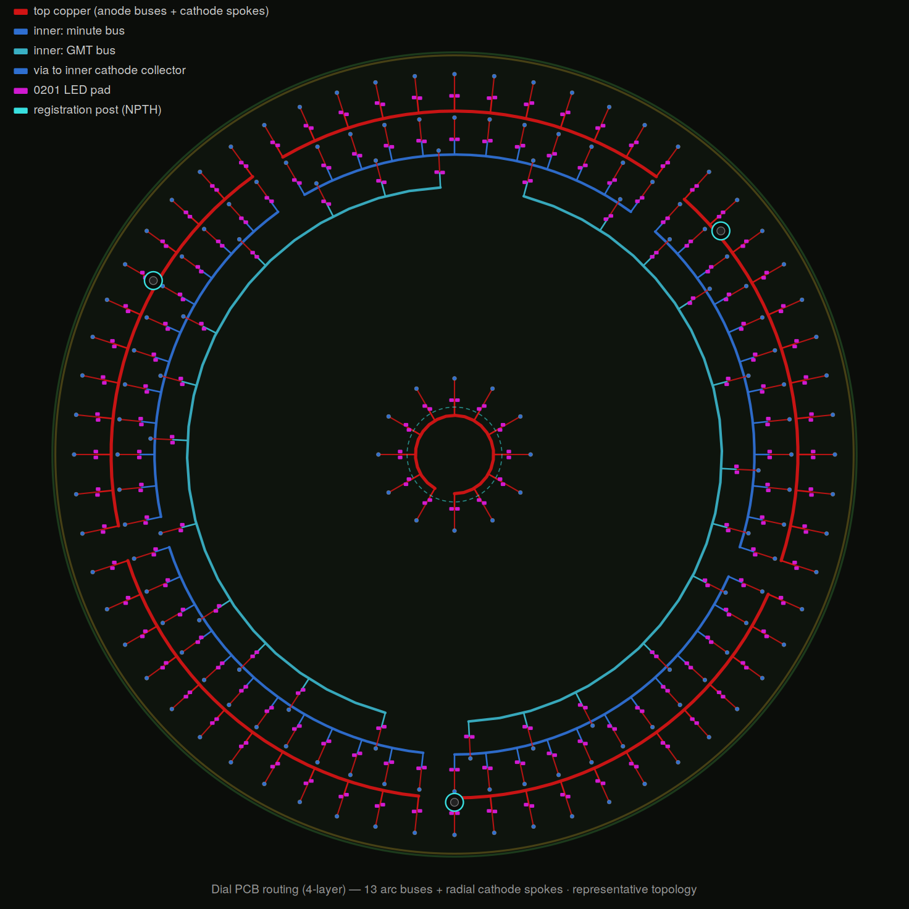

# ⚠️ STALE — Charlieplex scheme superseded

> These files implement the OLD **Charlieplex arc-bus** wiring (ATmega328P era).
> The architecture moved to an **IS31FL3743A matrix driver** (see
> `/pcb/controller/README.md`). The LED **positions** here are still valid, but the
> **wiring/netlist** must be regenerated to the driver's row×column matrix grid.
> `dial.net`, `connections.csv`, `dial_pcb_route.*`, `optimize_lowpins.py`, and the
> Charlieplex net assignment are stale. Regenerating this is the main open task.

<picture>
  <source media="(prefers-color-scheme: dark)" srcset="dial_pcb_route.png">
  
</picture>

---

# Dial board — placement & Charlieplex netlist

Generated artifacts for the 37 mm dial PCB (156 LEDs, 13-pin Charlieplex).

| File | What it is |
|---|---|
| `generate_placement.py` | Source of truth. Computes 156 LED positions + the Charlieplex net assignment, verifies all 156 (hi,lo) pin-pairs are unique, writes the JSON/CSV. |
| `dial_placement.json` | Machine-readable: every LED's xy (mm, origin=dial center, +Y up), angle, anode/cathode net, scan row; plus rings, posts, counts. |
| `dial_placement.csv` | Same as a flat table (ref, region, pos, x, y, angle, nets, scan_row). |
| `dial_kicad_gen.py` | Run in KiCad's Scripting Console (board open) to position footprints D1..D156 + posts H1..H3 from the JSON. Edit `CENTER_MM`. |
| `netlist_assignment.txt` | How to wire the nets in the schematic (CP0..CP12). |
| `dial_layout.svg` / `.png` | Visual check, colored by scan row = arc clusters. |

## Workflow into KiCad
1. In the **schematic**: place 156 LEDs (D1..D156), 13 series resistors (CP0..CP12),
   and the board-to-board connector. Label each LED's anode/cathode net per
   `dial_placement.csv` (`net_anode`, `net_cathode`).
2. Import the netlist to a blank `.kicad_pcb`.
3. Set the dial center on the sheet, edit `CENTER_MM` in `dial_kicad_gen.py`,
   run it from the Scripting Console to auto-place all parts.
4. Route: each scan row's 12 LEDs are a contiguous arc sharing one HIGH net —
   run that net as a short arc bus, with radial cathode spokes.

## Key facts baked in
- 13 nets, 156 LEDs, 13×12 unique ordered pin-pairs (verified).
- Rings: second r16.5 / minute r14.5 / GMT LED r13 (piped to r18 rim) / hour r2.5.
- 3 asymmetric registration posts at 0°, 130°, 240°, r16.
- 0201 footprints; reflow assembly assumed.

## Routing render
- `generate_routing.py` → `dial_pcb_route.svg` / `.png`: representative 4-layer
  routing in PCB style — 13 arc buses (color = layer), radial cathode spokes,
  vias to inner cathode collectors, 0201 pads, NPTH registration posts.
  Proves the arc-bus topology fits; not a DRC-clean Gerber (route for real in KiCad).

## Netlist & optimization (added)
- `optimize_lowpins.py` — Hungarian per-row assignment minimizing cathode spoke
  length. Cut total spoke travel ~27%. Preserves all 156 unique (hi,lo) pairs
  (any per-row permutation keeps Charlieplex uniqueness, so rows optimize independently).
- `generate_netlist.py` → `dial.net` (KiCad legacy netlist, import via "Update PCB
  from netlist") + `connections.csv` (flat net/ref/pin table).
  Components: 156 LED + 13 R + 1 connector. Nets: 13 CP buses + 13 MCU-drive + GND + VLED.
